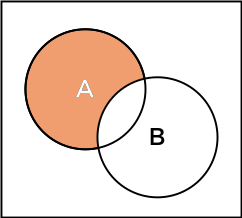
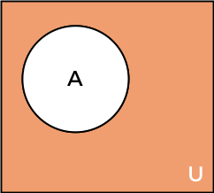

# Lab (1) Notes
Ahmed Al-Qassas [qassas.ahmed@mau.edu.eg](qassas.ahmed@mau.edu.eg)  
Spring 2023-24
---
# Basic Set Theory
## Sets
A set is a well-defined collection of objects  called elements or the members of the set. An element can **not** be repeated within a set.
### Relation between A Set and Elements
Given a set `S`,   
`a ∈ S` means that `a` belongs to `S`.    
`b ∉ S` means that `b` does **not** belong to `S`.
### Relation between Sets
`S1 ⊂ S` means that `S1` is a subset of `S`  
It also means that `S` is a superset of `S1`  
If `S ⊂ S1` and `S1 ⊂ S` , then `S = S1`
### Algebraic Operations on Sets (With Python)
#### 1. Union
Given two sets `A` and `B`. The **union** operation _merges_ the two sets together into a new set containing all the elements within them.  The result of an algebraic operation on sets _is still a set_. Hence, still no duplicates allowed meaning if an element appears in both sets that are to be union-ed, **it is only taken once**.
```python
a = {2, 3, 4}
b = {3, 5, 6}
a_union_b = a.union(b)
print(a_union_b) #output: {2, 3, 4, 5, 6}
```


#### 2. Intersection
Given two sets `A` and `B`. The **intersection** operation selects only the common elements in both sets.
```python
a = {2, 3, 4}
b = {3, 4, 5, 6}
a_intersection_b = a.intersection(b)
# another option is to use A & B
print(a_intersection_b) #output: {3, 4}
```

#### 3. Difference
The difference operation between two sets `A` and `B`. can have two forms; either `A - B` or `B - A` and the result will differ.
* `A - B` results in all elements that in `A` but not `B`.
* `B - A` results in all elements that in `B` but not `A`.  
In Python you can, also, find the symmetric difference which refers to the element that in a alone union-ed the elements in b alone. and ignoring what is in common.
```python
a = {2, 3, 4, 5}
b = {3, 4, 7, 9}
a_diff_b = a.difference(b)
b_diff_a = b.difference(a)
print (a_diff_b)
print("difference is commutative" if a_diff_b == b_diff_a else "difference is NOT commutative") #output: {2, 5}
#difference is NOT commutative
```
```python
a = {2, 3, 4, 5}
b = {3, 4, 7, 9}
symm_diff = a ^ b
print(symm_diff) #output: {2, 5, 7, 9}
#3 and 4 were ignored
```

#### 4. Complement
 The complement operation is defined by taking **the set difference between the universal set and the given set**. In Python, sets do not have an inherent concept of a universal set, so when we talk about the complement of a set, we typically imply that it is **with respect to some other set**. 
```python
# Define the universal set
universal_set = {1, 2, 3, 4, 5}

# Define a set
set_A = {2, 4}

# Get the complement of set_A with respect to the universal set
complement_A = universal_set - set_A

print(complement_A)  # Output: {1, 3, 5}
```
  
#### 5. Cartesian Product


