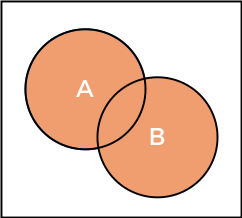
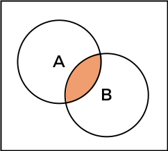

# Lab (1) Notes
Ahmed M. Al-Qassas [qassas.ahmed@mau.edu.eg](qassas.ahmed@mau.edu.eg)  
Spring 2023-24
---
# Basic Set Theory
## Sets
A set is a well-defined collection of objects  called elements or the members of the set. An element can **not** be repeated within a set.
### Relation between A Set and Elements
Given a set `S`,   
`a ∈ S` means that `a` belongs to `S`.    
`b ∉ S` means that `b` does **not** belong to `S`.
```python
set_1 = {'a', 'b', 'c'}
a_belongs_to_set_1 = 'a' in set_1
print("element 'a' belongs to set_1" if a_belongs_to_set_1  else "element 'a' does not belong to set_1")
```
### Relation between Sets
`S1 ⊂ S` means that `S1` is a subset of `S`  
It also means that `S` is a superset of `S1`  
If `S ⊂ S1` and `S1 ⊂ S` , then `S = S1`
```python
set_1 = {'a', 'b', 'c'}
set_2 = {'a', 'b', 'c', 'd'}
set_1_subset_of_set_2 = set_1 <= set_2
# other option is set_2 => set_1
# there are also set_1.issubset(set_2) and set_2.issupperset(set_1)
print("set_1 is a subset of set_2" if set_1_subset_of_set_2 else "set_1 is not a subset of set_2")

```
### Algebraic Operations on Sets (With Python)
#### 1. Union
Given two sets `A` and `B`. The **union** operation _merges_ the two sets together into a new set containing all the elements within them.  The result of an algebraic operation on sets _is still a set_. Hence, still no duplicates allowed meaning if an element appears in both sets that are to be union-ed, **it is only taken once**.
```python
a = {2, 3, 4}
b = {3, 5, 6}
a_union_b = a.union(b)
# other option is to use a | b
print(a_union_b) # output: {2, 3, 4, 5, 6}
```



#### 2. Intersection
Given two sets `A` and `B`. The **intersection** operation selects only the common elements in both sets.
```python
a = {2, 3, 4}
b = {3, 4, 5, 6}
a_intersection_b = a.intersection(b)
# another option is to use A & B
print(a_intersection_b) #output: {3, 4}
```

#### 3. Difference
The difference operation between two sets `A` and `B`. can have two forms; either `A - B` or `B - A` and the result will differ.
* `A - B` results in all elements that in `A` but not `B`.
* `B - A` results in all elements that in `B` but not `A`.  
In Python you can, also, find the symmetric difference which refers to the element that in `A` alone union-ed the elements in `B` alone and ignoring what is in common.
```python Symmetric difference is commutative
a = {2, 3, 4, 5}
b = {3, 4, 7, 9}
a_diff_b = a.difference(b)
# other option is to use a - b
b_diff_a = b.difference(a)
print (a_diff_b)
print("difference is commutative" if a_diff_b == b_diff_a else "difference is NOT commutative") # output: {2, 5}
# difference is NOT commutative
```
```python
a = {2, 3, 4, 5}
b = {3, 4, 7, 9}
symm_diff = a ^ b
# other option is to use a.symmetric_difference(b)
print(symm_diff) # output: {2, 5, 7, 9}
# 3 and 4 were ignored
# Symmetric difference is commutative
```

#### 4. Complement
 The complement operation is defined by taking **the set difference between the universal set and the given set**. In Python, sets do not have an inherent concept of a universal set, so when we talk about the complement of a set, we typically imply that it is **with respect to some other set**. 
```python
# Define the universal set
universal_set = {1, 2, 3, 4, 5}

# Define a set
set_A = {2, 4}

# Get the complement of set_A with respect to the universal set
complement_A = universal_set - set_A

print(complement_A)  # Output: {1, 3, 5}
```
  

#### 5. Cartesian Product
In Python, you can compute the Cartesian product of sets using the `itertools.product()` function, which is available in the itertools module. The Cartesian product of sets `A` and `B` is the set of all possible ordered pairs `(a, b)` where `a` is an element of set `A` and `b` is an element of set `B`. The table below shows of `A × B`

|       | a      | b      | c      |
|:------|:-------|:-------|:-------|
| **1** | (1, a) | (1, b) | (1, c) | 
| **2** | (2, a) | (2, b) | (2, c) |


```python
import itertools

a = {1, 2}
b = {'a', 'b', 'c'}

# Compute the Cartesian product
axb = set(itertools.product(a, b))
bxa = set(itertools.product(b, a))
print(axb)
print(bxa)
print("Cartesian Product is commutative" if axb == bxa else "Cartesian Product is NOT commutative")
# {(2, 'c'), (1, 'a'), (1, 'b'), (1, 'c'), (2, 'a'), (2, 'b')}
# {('c', 1), ('a', 1), ('b', 1), ('a', 2), ('b', 2), ('c', 2)}
# Cartesian Product is NOT commutative
```

#### 6. Cardinal Number
A cardinal number of a set `A` denoted as `n(A)`  refers to the number of elements within the `A`. To find it, we just need to use `len()` function. Easy.
```python
a = {i for i in range(50)}
n_a = len(a)
print(n_a)
```

# Equivalence Relation
Formal Languages and Automata: Equivalence relations are used in formal language theory and automata theory to define concepts like equivalence of regular expressions, indistinguishability of states in finite automata, and minimization of finite state machines.
- `∀x ∈ A, x∼x`  
- `∀x,y ∈ A, x∼y ⟹ y∼x`  
- `∀x, y, z ∈A, (x∼y∧y∼z) ⟹ x∼z`  


