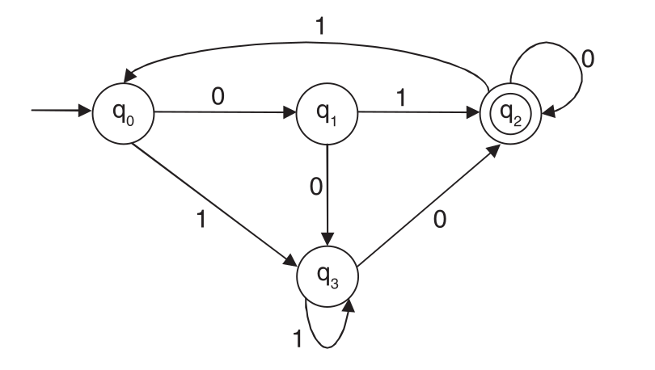
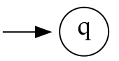
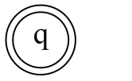

# Lab (3) Notes
Ahmed Al-Qassas [qassas.ahmed@mau.edu.eg](qassas.ahmed@mau.edu.eg)  
Spring 2023-24
----
# 0. Review on Lab (2)
Chomsky structured a hierarchy of formal languages based on the properties of the grammar required to generate the languages.

| Grammar  | Language                   | Machine Format          |
|:---------|:---------------------------|:------------------------|
| _Type 0_ | Unrestricted Language      | Turing Machine          |
| _Type 1_ | Context-sensitive language | Linear bounded automata |
| _Type 2_ | Context-free language      | Push down automata      |
| _Type 3_ | Regular Expression         | Finite automata (FSM)   |

# 1. Use of Automata
The main usefulness is in **lexical analyser** and syntax error. **But what is lexical analyser**?  
Lexical Analysis is the first phase of the compiler also known as a scanner. It converts the High level input program into a sequence of _Tokens_.
[Read this article](https://www.geeksforgeeks.org/introduction-of-lexical-analysis/) for more information.   
## Example on Lexical Analyser:
```C
// This is a loop
while(a >= b){
    a = a - 2;
}
```

| Lexemes | Tokens     | Lexemes  | TOKENS      |
|:--------|:-----------|:---------|:------------|
| while   | WHILE      | a        | IDENTIFIER  |
| (       | LAPREN     | =        | ASSIGNMENT  |
| a       | IDENTIFIER | a        | IDENTIFIER  |
| >=      | COMPARISON | –        | ARITHMETIC  |
| b       | IDENTIFIER | 2        | INTEGER     |
| )       | RPREN      | ;        | SEMICOLON   |


# 2. Finite Automata
It is called finite because it has a **finite number of states**. The _state_ of the system memorizes the information concerning the past input. It is necessary to determine the future behaviour of the system.

A finite automata is defined by a five tuple:  
M = {Q, Σ, δ, q<sub>0</sub>, F}
* **Q**: Finite non-empty set of states.
* **Σ**: Finite non-empty set of input symbols.
* **δ**: Transitional function.
* **q<sub>0</sub>**: Beginning state.
* **F**: Finite non-empty set of final states.

# 3. FA Types: DFA and NFA
A string is declared accepted by an FA if the string is finished and the machine has reached a final.
state.
## DFA  
DFA is a finite automata where, for all cases, when a single input is given to a single state, the  **machine goes to a single state**, i.e., all the moves of the machine can be uniquely determined by the present state and the present input symbol.

## NFA 
Non-deterministic finite automata  NFA is a finite automaton where, for some cases, when a single input is given to a single state, **the machine goes to more than one states**, i.e., some of  the moves of the machine cannot be uniquely determined by the present state and the present input symbol.

# 4. Examples
## Example 1: check whether the stings accepted by the given FA, and determine whether it is an DFA or NFA.
* string 1: **0111100**
* string 2: **11111**
* string 3: **11010**

----
###### Notes
The symbol   refers to the start (initial) state while final state is represented by   

----
###### Solution 
string 1: **0111100**


