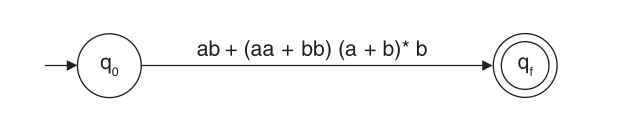
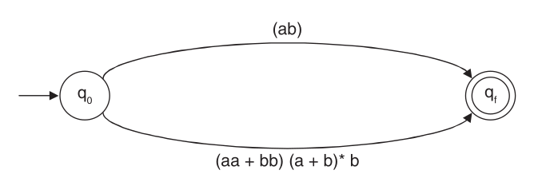
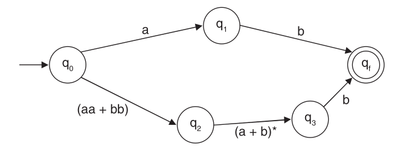
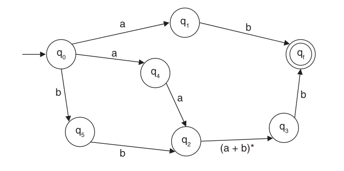
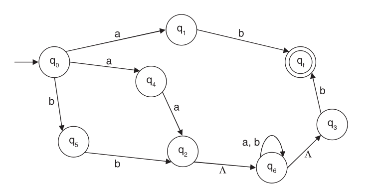
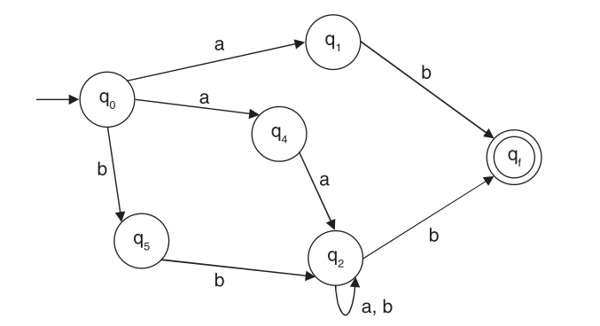
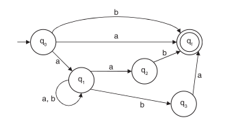
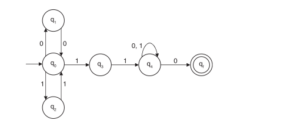
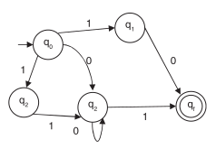

# Lab (4) Notes
Ahmed M. Al-Qassas [qassas.ahmed@mau.edu.eg](qassas.ahmed@mau.edu.eg)  
Spring 2023-24  

# 0 Review on Previous Labs (2, 3)

| Grammar  | Language                   | Machine Format          |
|:---------|:---------------------------|:------------------------|
| _Type 0_ | Unrestricted Language      | Turing Machine          |
| _Type 1_ | Context-sensitive language | Linear bounded automata |
| _Type 2_ | Context-free language      | Push down automata      |
| _Type 3_ | Regular Expression         | Finite automata (FSM)   |

It is called finite because it has a **finite number of states**. A finite automata is defined by a five tuple: M = {Q, Σ, δ, q<sub>0</sub>, F}. FA can be either DFA or NFA. One can convert from NFA to DFA.

# 1 Regular Expression (RE)
It is the language or the strings accepted by a FA.

# 2 Operations on Regular Expression
Three basic operations are **union, concatenation, and closure**.

## 2.1 Closure and Kleene's Closure
| Type               |Definition                       | Applied on                      |
|:-------------------|:--------------------------------|:--------------------------------|
|Kleene's Colsure Σ* |All possible strings formed by **zero or more repetitions** of elements|Applied on Alphabet Σ            |
|Colsure R*          |The iteration of the same string |Applied on RE                   |  

## Example 1 (5.1) discussed in Python
Describe the following REs in English language.  
1. 10*1
2. a\*b*
3. (ab)\*
4. (a\*+b*)c\*
5. (00)*(11)\*1
   
```Python
import re
reg_1 = re.compile("10*1") # Easy
reg_2 = re.compile("a*b*") # Easy
reg_3 = re.compile("(ab)*") # Easy

reg_4 = re.compile("[ab]*c*")
m = re.findall(reg_4, "ac bc aabc abc c a b")
print(m) # ['ac', '', 'bc', '', 'aabc', '', 'abc', '', 'c', '', 'a', 'b']
# Any combination of ‘a’ or any combination of ‘b’ followed by any combination of ‘c’ will be accepted.

reg_5 = re.compile("(00)*(11)*1") # Easy
```

## Example 2 (5.2)discussed in Python
Built regular expression of the following:
1. Any **combination** of a and b, **beginning with a and ending with b**.
2. Any **combination** of a and b containing abb as a substring.
3. RE of a and b **containing at least 2 ‘a’s**.
4. Write an RE for the language L = {anbm | where m + n is even}.
5. An RE of a and b, having exactly one ‘a’.


```Python
# 1- L = a(a + b)*b.
reg_1 = re.compile(r"\ba[ab]*$b\b")

# 2- L = (a + b)*abb(a + b)*.
reg_2 = re.compile(r"[ab]*aab[ab]*")
m = re.findall(reg_2, "aab ab aaabb abaabab")
print(m) # ['aab', 'aaabb', 'abaabab']

# 4- L = (aa)*(bb)* + (aa)*a(bb)*b.
reg_4 = re.compile(r"(aa)*(bb)* | (aa)*a(bb)*b")

# 3- L = b*ab*ab*
reg_3 = re.compile(r"b*ab*a+b")

# 5- L = b*ab*
reg_5 = re.compile(r"b*ab*")

```
# 3 Constructing FA from RE
For making an FA from an RE, there are two steps as given in the following.  

**Step I:** From the given RE, an equivalent transitional system (FA) with Λ move has to be constructed.
1. *Top-down approach*: FA construction starts from the given RE and ends by reaching a single element for each transition.
2. *Botton-up approach*: FA construction starts from the basic element and ends on reaching the RE.


**Step II:** From the transitional system with Λ moves, a DFA needs to be constructed by the ε closuremethod.


# 3.1 Example 3 (5.11) Explained
Construct Finite Automata equivalent to the Regular Expression:  
**L = ab(aa + bb)(a + b)\* b.**    
Note: we use top-down approach.  

**STEP 1** We put our RE between 2 two states; start and final states.

   
**STEP 2** The `+` is converted to 2 branches to the same statas.


**STEP 3** The `dot` or concatination is converted to sequence of transitions between new states.  



**STEP 4** The `*` is converted to a loop.


**STEP 5** Removing the `Λ` transitions.


## Conclustion
The process of converting a RE into a FA can be summarized as a sequence of removing `+` and `dot` and `*` and `Λ` and adding corresponding transitions/states in their place.
# 4 Try it yourself 
## Solved Problem 2
Find the RE for the following:
1. The set of language of all strings of 0 and 1 containing exactly two 0’s.  
2. The set of languages of any combination of ‘a’ and ‘b’ beginning with ‘a’.  
3. The set of all strings of 0 and 1 that do not end with 11. 
4. The set of languages of any combination of ‘0’ and ‘1’ containing at least one double symbol.
5. The set of all strings over {a, b} in which the number of occurrences of ‘a’ is divisible by 3.
6. The set of all strings where the 10th symbol from the right end is a 1.  
7. The set of languages of any combination of ‘0’ and ‘1’ containing no double symbol.

**Solutions**
1. L = 1\*01\*01*.
2. L = a(a+b)*.
3. L = (0+1)*(00 + 01+10).
4. L = (0+1)* (00+11) (0+1)*.

## Solved Problem 8, 9, 10
8. Construct an FA equivalent to the RE, `L = (a + b) + a(a + b)* (ab + ba)`. 

10. Construct an FA equivalent to the RE, `L = (00 + 11)* 11 (0 + 1)*0`.
  
12. Construct an FA for the RE `10 + (0 + 11)0*1`.  

# Assignment
Excercise 
# Thank You


